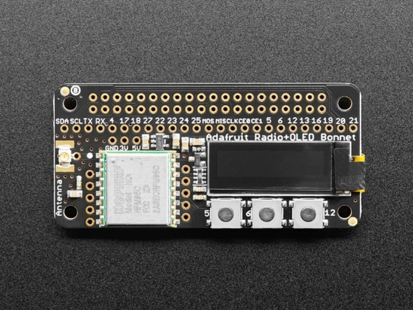
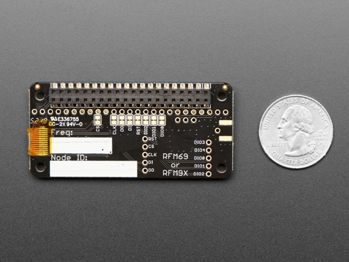

# LoRa Radio Hardware Installation:

  
   

## Connecting the LoRa Radio Hat:

1. **Preparing the Hat**: The LoRa Radio Hat is designed to be easy to install. It has pre-soldered female headers that directly fit onto the Raspberry Pi GPIO (the set of pins sticking out of the Raspberry Pi). Make sure the OLED screen (the little display on the hat) is facing upwards.

2. **Attaching the Hat**: Gently slide the female headers of the hat onto the GPIO pins of the Raspberry Pi. It's important to do this slowly and evenly, and without applying too much force. If it feels like you have to push too hard, stop and double check everything. If you're still having trouble, check with your StemX mentors.

3. **Connecting the Antenna**: Once the hat is properly connected, you'll need to attach the antenna. Look for a small, round connector on the middle left side of the hat (it's the only one like it). This connector, called a UFL connector, is where you'll connect the antenna adapter cable.

4. **Attaching the Antenna Cable**: The antenna adapter cable has a small, round end that fits onto the UFL connector on the hat. Carefully press it onto the connector until it clicks into place. The connector is quite delicate, so be gentle to avoid damaging it. 

5. **Checking the Connection**: Once the cable is connected, gently tug on it to make sure it's secure. It should move a little bit in a circular motion, but it shouldn't feel loose or fall off.

`Remember, take your time and be careful. You're dealing with delicate components and connections!`

  
   

