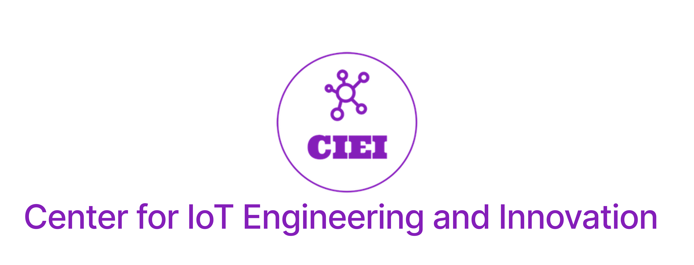

# StemX East Carolina University Hack-A-Thon 2023

## Challenge:

Your task is to use image capturing machine learning (ML) to identify chess pieces shown on a camera. Your goal is to transmit the count of a specific type of chess piece to our network, PITON, using a LoRa radio. You will be given the LoRa radio, starter code for data transmission, and a set of identifiers. Your team will work to modify the existing code to perform the following tasks:

1. Train the image capturing ML to identify and count a specific type of chess piece.
2. Transmit the count of the identified chess piece over LoRa to the PITON network.

The challenge is divided into two phases:

**Phase 1:** Modify the provided starter code to train the image capturing ML, identify and count a specific chess piece, and transmit the count over LoRa to the PITON network. Points will be awarded based on how quickly your team can accomplish this.

**Phase 2:** You will be given a new dataset, and your task will be to improve the accuracy of your ML model. Points will be awarded based on the accuracy of your model in comparison to other teams.

The winner of the Hack-A-Thon will be the team with the highest total points from both phases.

## Format:

Each team will consist of 3-6 members. No team may have more than 3 members from the same school district. Teams will not need to register on the StemX website. We will distribute all necessary materials.

## Getting Started:

You will be provided with a Raspberry Pi, a LoRa radio, and a set of identifiers. You will need to install the LoRa radio hat on the Raspberry Pi and connect it to the PITON network. You will also be given starter code, which you will need to modify to train the image capturing ML and transmit data over LoRa.

## When Complete:

Once your team has successfully trained your ML model, identified and counted a specific chess piece, and transmitted the count to the PITON network, you have completed Phase 1 of the challenge. You will then be given a new dataset to improve the accuracy of your model for Phase 2.

## Submission:

Your team's code should be committed to your team's folder in the provided GitHub repository. This is part of the challenge and will be considered during the scoring.

## Resources
- [Instructional PowerPoint](https://studentsecuedu66932.sharepoint.com/:p:/r/sites/Funding/Shared%20Documents/General/STEMx-Proposal/Planning/Instruction/STEMx%20Classroom%20Presentation%20SKB%20updates.pptx?d=w48561c02fdc94bb88167919ebf53c84d&csf=1&web=1&e=6sADC6)
- [StemX Website](https://dodstem.us/meet/)
- [Git Basics Guide](https://git-scm.com/book/en/v2/Git-Basics-Getting-a-Git-Repository)
- [LoRa Radio Hardware Installation Guide](RADIO.md)
- [DATA.md file for data layout instructions](DATA.md)

Participants are encouraged to use any available resources, including the internet, to assist them in completing the challenge.

#### We look forward to seeing the innovative solutions that our teams will create!

  
   

