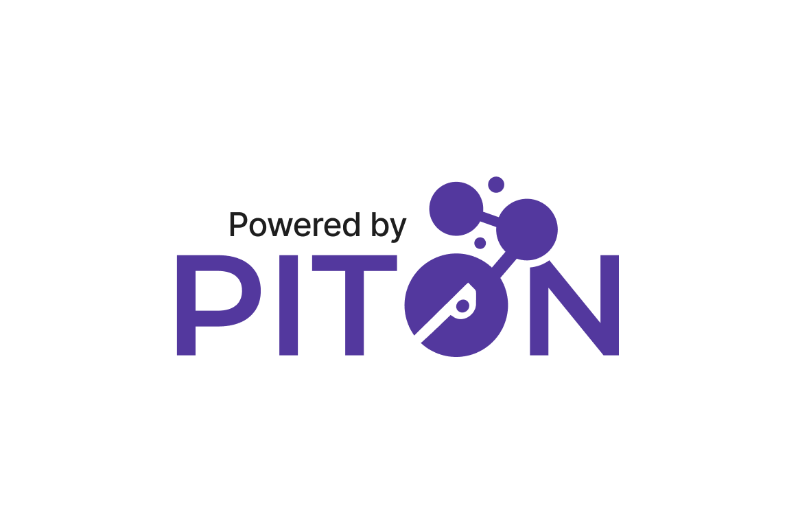

# StemX East Carolina University Hack-A-Thon 2023

## Challenge:

The challenge for this year's Hack-A-Thon is to develop a system that utilizes image-capturing machine learning to identify specific items (preferably a certain animal) shown on camera within a sample window of 5 minutes. The system should then transmit the count of the identified items over LoRa to our network, PITON. Teams will be provided with a LoRa radio, prior code for data transmission, and a set of identifiers. The goal is to only transmit the counts of the identified item. The first team to successfully register their Raspberry Pi with the LoRaWAN network, capture the count, and transmit the count to PITON within the sample window will be declared the winner. A pre-generated dashboard will light up green when any data transmission is received, regardless of the correctness of the count.

Teams will be required to add their code to their specific group folder in the starter code GitHub repository and commit their changes back to the repository.

## Format:

The Hack-A-Thon will be conducted over several days, with specific start and end times provided to the teams at the kick-off event. The event will be a combination of in-person activities at the East Carolina University campus and remote collaboration. Teams will be composed of 5 to 6 members, with no more than 3 members from the same school district. Each team will present their project to a panel of judges, who will select the winning teams based on the successful completion of the challenge, the item chosen for identification, and the effectiveness of their implementation.

## Getting Started:

All teams will receive a Hack-A-Thon kit during the kick-off event, which will include the LoRa radio, code for data transmission, and a set of identifiers. Teams are encouraged to familiarize themselves with these materials and begin brainstorming solutions.

Start by reading through the starting documentation:
- [LoRa Radio](RADIO.md)
- [Software Setup](SOFTWARE.md)

## When Complete:

When your team has completed your project, you must submit your work by presenting it to the judges. You will need to demonstrate your project and explain your approach. Each team will also be given a time slot to present their project to the judges. Make sure your team is available for your assigned time slot.

## Submission:

Submissions should include the following:

1. A demonstration of your project in action
2. A brief summary of your project (no more than 500 words)
3. Any necessary installation instructions or user guides
4. The identifier of the chosen item for identification
5. Link to your team's specific group folder in the GitHub repository

## Resources:

- [Instructional PowerPoint](#): A presentation providing an overview of the event and some tips for success, including information on how to train the model.
- [StemX Website](#): The main source of information for the event. Here you will find updates, resources, and the submission portal.
- [LoRa Radio Instructions](#): A guide on how to set up your LoRa radio and connect it to your Raspberry Pi
- Mentors: We have a group of experienced mentors from various STEM fields available to assist teams throughout the Hack-A-Thon. You will be able to schedule a consultation with them through the StemX website.

#### We look forward to seeing the innovative solutions that our teams will create!

  
   

