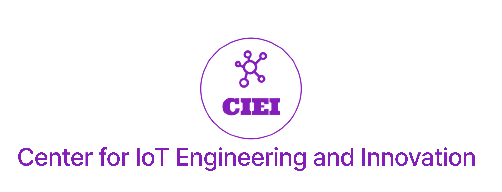
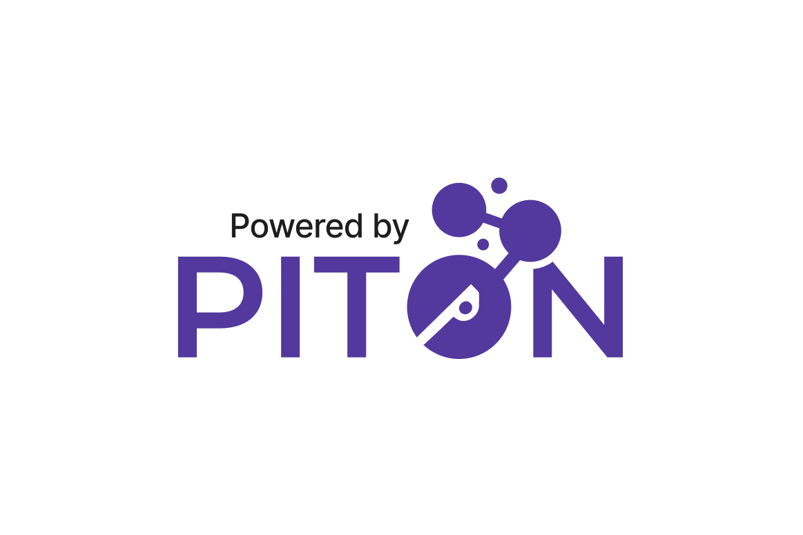

# StemX East Carolina University Hack-A-Thon 2023

## Challenge:

Your task is to use image capturing AI (Object Detection) to specific items shown on a camera. Your goal is to transmit the count of a specific type of item to our network, PITON, using a LoRa radio. You will be given the LoRa radio, starter code for data transmission, and a set of identifiers. Your team will work to modify the existing code to perform the following tasks:

1. Train the image capturing AI to identify and count a specific type of item.
2. Transmit the count of the identified item over LoRa to the PITON network.

The challenge is divided into two phases:

**Phase 1:** Train a new model to identify items. Determine a good sampling window. Modify the provided starter code to train the image capturing AI, identify and count a specific item (during sample window), and transmit the count over LoRa to the PITON network. Points will be awarded based on how quickly your team can accomplish this. ***You are required to commit your code in your teams hackathon folder before you are considered complete with Phase 1.***

`We will hold a review between phases where teams will be given a short amount of time to review and correct their code before Phase 2`

**Phase 2:** Your task will be to grade the accuracy of your Object Detection model. It is important to note that the accuracy will be based off the reported data in PITON. This means that if your LoRa data is improperly formatted it may effect your accuracy. Points will be awarded based on the accuracy of your model in comparison to other teams.

The winner of the Hack-A-Thon will be the team with the highest total points from both phases.

## Format:

Each team will consist of 3-4 members. We will distribute all necessary materials.

## Getting Started:

You will be provided with a Raspberry Pi, a LoRa radio, and a set of identifiers (`keys.py`).You have been given starter code, which you will need to modify to train the Object Detection AI (`yolov7/detect.py`) and transmit data over LoRa. You will need to install the LoRa radio hat on the Raspberry Pi and connect it to the PITON network. 

You may complete the tasks in any order that you choose. You have some experience with the Object Detection script as it is the same one that you used last week. You will now being enforcing a sample window instead of an infinite loop. The LoRa code is all new to you but you have been given starter code to help you get started. You may need to modify the code to transmit the count of a specific item over LoRa to the PITON network. 

`It is important to review each file and understand what is happening before makes changes.`

**YOU MUST** adhere to the [Data Formatting Guidelines](hackathon/DATA.md) to get full points!

#### Recommended Order (Phase 1):
1. Read all `.md` Markdown files
2. Review ClassroomPresentation PDF
3. ***SKIP THS STEP*** Train your model (Chess Pieces****.zip)
4. Modify the Object Detection Code
  4.1 Inside of the `/home/pi/yolov7` directory modify the `detect.py` to find counts of your specific class (store this in variables or a list and TEST (print the variable or list))
    - remember `names[int(c)]` shows the class that is in index c. You can figure out if that value is equal to your class with a simple `if` where you
  4.2 Copy that code into the data.py file in the top of the get_data() function 
  4.3 Think about the parameters we passed into the detect.py file with the command `python3 detect.py --weights yolov7.pt --source 0`. When you copy and paste that code you will also have to somehow trick it into thinking those parameters were passed so before that part of the code runs you need to add the following:
      - Set the variable `weights` = `['yolov7.pt']`
      - Set the variable `source` = `'0'`
      - Set the variable `image_size` = `640`
      - Set the variable `conf_thres` = `0.25`
      - Set the variable `iou_thres` = `0.45`
      - Set the variable `device` = `''`
      - Set the variable `view_img` = `False`
      - Set the variable `save_txt` = `False`
      - Set the variable `save_conf` = `False`
      - Set the variable `nosave` = `False`
      - Set the variable `classes` = `None`
      - Set the variable `agnostic_nms` = `False`
      - Set the variable `augment` = `False`
      - Set the variable `update` = `False`
      - Set the variable `project` = `'runs/detect'`
      - Set the variable `name` = `'exp'`
      - Set the variable `exist_ok` = `False`
      - Set the variable `no_trace` = `False`
  4.4 Copy the other files inside of the `yolov7` into the `lora` folder
  4.5 Set your interval by changing the loop from **infinite** to set a sample window 
  4.6 Take your variable or list (after the sample time window) and encode it into a `bytearray`
5. Setup LoRa Radio and Code
  5.1 Follow `RADIO.md` and `SOFTWARE.md`
6. Modify the LoRa Code
  6.1 You **MAY** have to make changes to this file. Read the comments
  6.2 When the `main.py` runs it will wait for the `get_data()` function to be done before its transmits (aka you dont have to set the time interval again)
7. Transmit your data to PITON
    7.1 To run the LoRa code (transmit) you need to run: `python3 main.py`
8. Commit Code with Git

## When Complete:

Once your team has successfully trained your Object Detection model, identified and counted a specific chess piece, and transmitted the count to the PITON network, you have completed Phase 1 of the challenge. You will then be given a new set of instructions to test the accuracy of your model for Phase 2.

 **Phase 2 will being for everyone at the same time.** You will have a short amount of time to review and correct your code before Phase 2 begins.

## Submission:

Your team's code should be committed to your team's folder in the provided GitHub repository. This is part of the challenge and will be considered during the scoring. You will **COMMIT** your code to the repository. **DO NOT PUSH** the code to the remote repository until the end of the challenge (Others will be able to see your work if you do)

## Resources
- [Instructional PowerPoint](StemXClassroomPresentation.pdf)
- [StemX Website](https://dodstem.us/meet/)
- [Git Basics Guide](https://git-scm.com/book/en/v2/Git-Basics-Getting-a-Git-Repository)
- [LoRa Radio Hardware Installation Guide](Hackathon/RADIO.md)
- [DATA.md file for data layout instructions](Hackathon/DATA.md)
- [LoRa Software Instructions](Hackathon/SOFTWARE.md)

Participants are encouraged to use any available resources, including the internet, to assist them in completing the challenge.

#### We look forward to seeing the innovative solutions that our teams will create!

  
   

